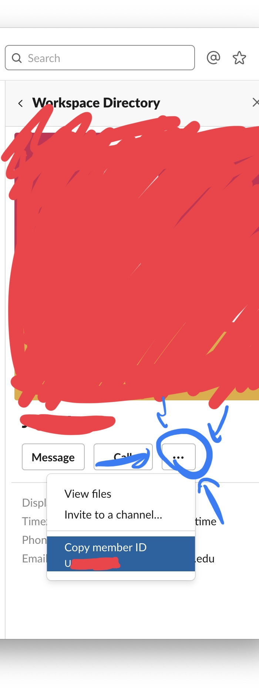

# Chore Selector Bot
This is a Haskell service that goes with a chore selector bot that runs
on the [voncramm slack](voncramm.slack.com).

## How To

1. Acquire a virtual machine with a public IP address. You will need to make
   sure that you have ssh access to the virtual machine. In what follows I will
   assume that you have the username *user* and the password *password* which
   accesses a server addressable via *myaddress.com*. I further assume that your
   virtual machine is running a flavor of Ubuntu.

   If it is before fall 2020 it is likely that you can ask Devin
   (djl329@cornell.edu) for this information. He can obtain this for free and
   give you the relevant information.

2. The first thing you need to do is modify the url that the service will be
   listening from. Go to https://api.slack.com/apps/AFRNNGFSS/slash-commands
   and modify each command so that the url field for the command
   `/chore-command` is `http://myaddress.com/command` for each of the commands.
   If you are not yet a member of the slack app ask a previous HM, and they
   should be able to help you out by adding you as a collaborator.

3. ssh to the server using the following command (replace the default things).
   You will need to execute this command from the command line (Terminal.app
   on macOS, powershell on windows, or you know how to do this already on
   linux).

   ```
   ssh user@myaddress.com
   ```

4. The server will prompt you for a password. Type the password, nothing will
   display, but keep typing the command line recognizes what you are writing.
   When you are done typing the password, press enter.

5. The first thing you need to do is install [Haskell stack][stack]. To do this
   enter the command:

   ```
   curl -sSL https://get.haskellstack.org/ | sh
   ```

6. Then make sure you have git installed:

   ```
   apt install git
   ```

7. Invite everyone that will participate in chore selection to the
   `#chore-selection` slack channel.

8. Update the ids manifest. This is the worst part. I actually have a really
   good idea for how to make this better, but I can't implement it today, and
   can't promise to do it before chore selection on Sunday.
   You need to produce a list of names matched with their slack id.
   You can find this list from a previous semester in `src/Lib.hs`, it looks
   like this:
   ```
   ids =
       [ ("UCJUZ2REY", "Katie")
       , ("UCKSX0170", "Carmen")
       , ("U9GRD7WLW", "Agrippa")
       , ("UCFNFGQMB", "Emily")
       , ("UFN1D4B6U", "Tilda")
       , ("UCJCM7GA1", "Franco")
       , ("UFQEBH13L", "Raúl")
       , ("UCG6A4K61", "Xavier")
       , ("UCFS1RC5Q", "Maria")
       , ("UGN49A4Q1", "Anton")
       , ("UF5CK7QAZ", "Max")
       , ("UCFPC95A8", "Catie")
       , ("UBSD343V0", "Shane")
       , ("U9J774RDM", "Nellie")
       , ("UF7SF76NS", "Lucas")
       , ("UFQ9X0M43", "Nancy S.")
       , ("U9FDWB83B", "Fauna")
       , ("UFA5E4MMH", "Lillian Amanda")
       , ("UF554NBGA", "Liam")
       , ("UF953QPA9", "Aditi")
       , ("UCLDEKEPJ", "Cassie")
       , ("UCMEMCD39", "Gary")
       , ("UCKPJSASV", "Bea")
       , ("UCFT397LK", "John")
       , ("UCFSLM734", "Malcolm")
       ]
   ```
   To get these ids what you need to do is first click on someones name
   and then click view profile.

   

   Then click on the dots and copy the user-id.

   

   From here you can press the back arrow to go to the full directory of all
   slack members and search through them each individually to get their id.

   Edit `src/Lib.hs` to match this format with the new house members.

   The order of this list determines the order for chore selection.

7. Now you need to clone the repository containing the slack bot.

   ```
   git clone https://github.com/lehmacdj/chore-selection-bot
   ```

8. Enter the directory of the repository you just cloned.

   ```
   cd chore-selectoin-bot
   ```

9. Build the Haskell service.

   ```
   stack build
   ```

10. Run the Haskell service.

   ```
   stack exec chore-select-slack-bot-exe
   ```

   This begins chore selection.
   By default chore selections occur starting the next day at 10am and there
   is one selection per hour until 10pm each day.

<!--
11. The bot should now be active. In slack use the slack command
    `/chore-admin @houseManager1 @houseManager2` to make it so that
    some house managers are considered the admins from the bots perspective.
    Only these users will be able to use the `/chore-stop` and `/chore-init`
    commands until the bot is restarted.

14. Chore selection starts at the time that you type this command.
    By default chore selections occur starting the next day at 10am and there
    is one selection per hour until 10pm each day.
    You can stop chore selection by using `/chore-stop`. Note that it is
    **not possible to resume chore selection** if you do this, so please
    only do this for testing purposes before you begin chore selection for
    real.
-->

## Editing the chores
To change the listed chores you need to change the code a little bit.
The relevant part is something that looks like this in `src/Lib.hs`.
```
instance Show Chore where
    show (Chore 1) = "(1) 1st Floor Bathroom (Sunday)"
    show (Chore 2) = "(2) 1st Floor Bathroom (Wednesday)"
    show (Chore 3) = "(3) 2nd Floor Bathroom (Sunday)"
    show (Chore 4) = "(4) 2nd Floor Bathroom (Wednesday)"
    show (Chore 5) = "(5) 3rd Floor Bathroom (Sunday)"
    show (Chore 6) = "(6) 3rd Floor Bathroom (Wednesday)"
    show (Chore 7) = "(7) Basement Bathroom/Dining Room (Wednesday)"
    show (Chore 8) = "(8) Main Refrigerator (Sunday)"
    show (Chore 9) = "(9) Main Refrigerator (Sunday)"
    show (Chore 10) = "(10) Main Refrigerator (Wednesday)"
    show (Chore 11) = "(11) Private Fridge/Weight Room (Weekly)"
    show (Chore 12) = "(12) Freezer/Steward Fridge (Weekly)"
    show (Chore 13) = "(13) Living Room (Sunday)"
    show (Chore 14) = "(14) Living Room (Sunday)"
    show (Chore 15) = "(15) Living Room (Wednesday)"
    show (Chore 16) = "(16) Kitchen Commando (Weekly)"
    show (Chore 17) = "(17) Kitchen Commando (Weekly)"
    show (Chore 18) = "(18) Kitchen Commando (Weekly)"
    show (Chore 19) = "(19) Foyer/Mudroom (Weekly)/Mail Sorter (Daily)"
    show (Chore 20) = "(20) Hallways (Weekly)"
    show (Chore 21) = "(21) Laundry Room/Tool Room/Storeroom (Weekly/Daily)"
    show (Chore 22) = "(22) House Laundry (Weekly)"
    show (Chore 23) = "(23) Main Stairwell/Utility Closets (Sunday)"
    show (Chore 24) = "(24) Back Stairwell/Bone Pile/Lost & Found (Weekly)"
    show (Chore 25) = "(25) Dining Room/Pool Room (Sunday)"
```
This determines what chores are displayed. You can change the text to anything
to make it show whatever you want in the bot. Make sure you do this and make
sure the changes are available on the server before you start the service.

You also will probably want to edit
```
descriptions :: String
descriptions = "https://docs.google.com/document/d/1VZlbIs-vUvTR3_N2ycZgGb1I4hMCqsqOWiVbI6xc5SY/edit?usp=sharing"
```
to have a more recent url to a chores document.

[stack]: https://docs.haskellstack.org/en/stable/README/
